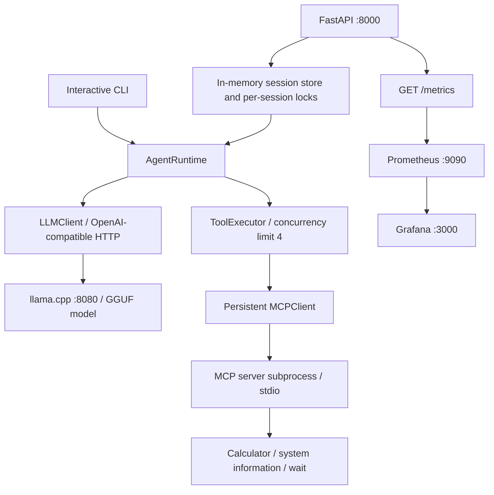

# Local LLM Agent

An open-source Python agent runtime for local GGUF inference with llama.cpp, LLM-driven MCP tool calling, concurrent tool execution, conversation sessions, and Prometheus/Grafana observability.

**Documentation scope: implemented functionality through v0.7.0.** Based on main commit `f1320eaaa23447d4916553ea56453a933f668994` (Prometheus metrics and Grafana dashboard). There is no v0.7.0 Git tag in this snapshot; package metadata still says `0.1.0` and FastAPI metadata says `0.6.0`. These version strings do not describe the full implemented feature set. v0.8 planning work is excluded.

## Contents

- [Features and architecture](#features-and-architecture)
- [Prerequisites and installation](#prerequisites-and-installation)
- [Model setup](#model-setup)
- [Start llama.cpp](#start-llamacpp)
- [CLI](#cli)
- [FastAPI and sessions](#fastapi-and-sessions)
- [MCP tools and client](#mcp-tools-and-client)
- [Errors and resilience](#errors-and-resilience)
- [Logging and monitoring](#logging-and-monitoring)
- [Benchmarks](#benchmarks)
- [Testing and linting](#testing-and-linting)
- [Project structure](#project-structure)
- [Troubleshooting](#troubleshooting)
- [Limitations and security](#limitations-and-security)
- [Roadmap](#roadmap)

## Features and architecture

Implemented milestones include local inference (v0.1), MCP client/server integration (v0.2), model-selected tools (v0.3), persistent MCP connections and parallel tools (v0.4), inference benchmarking (v0.5), session handling/resilience/structured logging (v0.6), and Prometheus/Grafana monitoring (v0.7).



For each turn, the runtime adds its system prompt, discovers MCP tools, converts their schemas to OpenAI function definitions, and asks the model to answer or call tools. Tool results are returned to the model for another round. Parallel execution uses `asyncio.gather`, preserves result order, and limits active calls to four through a shared executor semaphore. Sequential execution is available through `AgentRuntime(parallel_tools=False)`.

The default loop allows **five LLM rounds**, including the round that produces the final answer; it is not five tool rounds plus an additional synthesis round. Defaults are temperature `0.1` in the runtime, a 512-token completion cap, and a 120-second LLM request timeout. These are Python defaults, not environment-variable settings.

## Prerequisites and installation

- Python **3.12 or later** (`.python-version` selects the project interpreter).
- [uv](https://docs.astral.sh/uv/) on `PATH`, including for the MCP subprocess.
- A compatible GGUF model and enough memory for its weights, context/KV cache, and runtime overhead. No verified minimum RAM figure is recorded.
- Native llama.cpp for host inference, or Docker with Docker Compose for container inference.
- Docker Compose for the supplied monitoring stack; the Python API runs on the host.

```bash
git clone https://github.com/Archz017/local-llm-agent.git
cd local-llm-agent
uv sync --locked
```

Run the following commands from the repository root. The default uv sync includes the development dependency group (pytest, pytest-asyncio, pytest-httpx, Ruff). Runtime dependencies include HTTPX, Pydantic, FastAPI, Uvicorn, MCP, and prometheus-client; exact resolved versions are in `uv.lock`.

The source tree contains multiple top-level Python packages, while the build configuration installs only `local_llm_agent`. Add the source directory to this virtual environment so both host modules and the MCP subprocess can import it:

```bash
.venv/bin/python - <<'PYTHON'
import site
from pathlib import Path
Path(site.getsitepackages()[0], "local_llm_agent_src.pth").write_text(
    str(Path("src").resolve()) + "\n"
)
PYTHON
```

This writes only an ignored virtual-environment file. Repeat it if you recreate `.venv` or move the checkout. On Windows, use `.venv/Scripts/python.exe`. Setting `PYTHONPATH=src` alone is insufficient for the MCP subprocess: the locked MCP SDK inherits only a restricted environment and does not forward that variable. The commands below assume this setup step is complete.

## Model setup

The recorded experiments use **Qwen3-8B GGUF**, with `Q4_K_M` and `Q5_K_M` quantizations. Obtain a compatible GGUF from a trusted model publisher, check its license and integrity, and place it under `models/`. Weights are not bundled and no automated download command is provided by this repository.

Create `.env` for **Docker Compose interpolation**, using the actual filename you downloaded:

```dotenv
MODEL_FILE=Qwen3-8B-Q4_K_M.gguf
```

This filename is an example, not a required upstream artifact name. The Compose mount is read-only and the server resolves it as `/models/${MODEL_FILE}`. The Python application does not load `.env` or read `MODEL_FILE`.

`.gitignore` excludes `models/*` except `models/.gitkeep`, `.env` and `.env.*`, `.venv/`, logs, `data/`, and `benchmarks/results/`. It does **not** globally ignore GGUF files outside `models/`. Before committing, check:

```bash
git check-ignore models/Qwen3-8B-Q4_K_M.gguf .env
git status --short
```

Do not force-add model weights, credentials, or private conversation data. Ignore rules do not remove files already tracked by Git.

## Start llama.cpp

Choose one inference deployment; both use port 8080.

### Native launch

The performance report selected native llama.cpp with Metal on Apple Silicon, four server slots, and context size 8192. With a compatible `llama-server` already installed or built:

```bash
llama-server \
  -m ./models/Qwen3-8B-Q4_K_M.gguf \
  --host 127.0.0.1 --port 8080 \
  -c 8192 --jinja -ngl 99 -np 4 -cb
```

This is a launch recipe expressing the selected configuration, not a checked-in native launcher or an exact archived benchmark command. Verify supported flags with your binary's `--help` and confirm GPU offload, slot count, and effective per-slot context in its startup logs. The repository does not pin a llama.cpp revision. On non-Metal systems, configure the appropriate backend and offload settings for your hardware.

### Docker launch

After creating `.env` and placing the model in `models/`:

```bash
docker compose up -d llama-server
docker compose logs -f llama-server
```

The checked-in service uses `ghcr.io/ggml-org/llama.cpp:server`, publishes `8080:8080`, mounts `./models:/models:ro`, and sets `--host 0.0.0.0`, `--port 8080`, `-c 8192`, and `--jinja`. It does not explicitly configure GPU access, offload, or four-slot parallelism. Do not assume this Docker configuration matches native Metal performance.

### Verify inference

```bash
curl -f http://localhost:8080/health
curl -f http://localhost:8080/v1/chat/completions \
  -H 'Content-Type: application/json' \
  -d '{"messages":[{"role":"user","content":"Say hello briefly."}],"max_tokens":32}'
```

The LLM client defaults to `http://localhost:8080/v1` and health checks use `http://localhost:8080/health`. Custom URLs/timeouts require constructing `LLMClient` with different arguments or changing application wiring. No `LLM_BASE_URL` environment setting is implemented.

## CLI

```bash
uv run python -m agent.cli
```

The CLI keeps conversation history for the lifetime of that process and opens one persistent MCP connection. Try a calculation or ask for system information; tool selection is model-dependent.

**Known CLI details:** the installed `local-llm-agent` console script currently prints a placeholder greeting. Use the module command above to start the agent. Although the CLI banner says to type `exit`, the loop has no exit check; interrupt the process to stop it. An unhandled turn error terminates the CLI after removing the latest user message. JSON logging is configured by API startup, not by this CLI.

## FastAPI and sessions

Start one API worker with access to the host inference server:

```bash
uv run uvicorn api.app:app --host 127.0.0.1 --port 8000
```

Use `--host 0.0.0.0` when the monitoring containers need access through `host.docker.internal`; apply host firewall rules appropriately. Interactive API docs are at `http://localhost:8000/docs`, with the schema at `/openapi.json`.

| Method | Path | Behavior |
|---|---|---|
| GET | `/health` | Liveness: `{"status":"ok"}`; does not check dependencies |
| GET | `/ready` | Checks LLM health and MCP tool discovery; 200 if both ready, otherwise 503 |
| POST | `/sessions` | Creates a session; 200 with `session_id` |
| POST | `/chat` | Runs a turn in an existing session; 200 with `request_id`, `session_id`, `response` |
| GET | `/metrics` | Prometheus exposition; omitted from OpenAPI |

Create a session:

```bash
curl -sS -X POST http://localhost:8000/sessions
```

Copy its ID into the following request:

```bash
curl -sS http://localhost:8000/chat \
  -H 'Content-Type: application/json' \
  -d '{"session_id":"PASTE_SESSION_ID","message":"What is 15 multiplied by 20?"}'
```

Illustrative response shape (IDs and generated text vary):

```json
{"request_id":"generated-request-uuid","session_id":"your-session-uuid","response":"15 multiplied by 20 is 300."}
```

`ChatRequest` requires a string `session_id` and a string `message` of **1–10,000 characters**. This is a character limit, not a token/context budget. Whitespace-only strings are not explicitly rejected. Invalid payloads receive FastAPI validation errors (422); unknown sessions receive 404 with `{"detail":"Session not found."}`.

Sessions persist **between requests in one running process**, not across restarts. Each stores successful user/assistant exchanges in memory. Intermediate tool messages are local to the current runtime turn. Requests for the same session are serialized with a lock; different sessions can run concurrently. Failed turns roll back newly appended history. There is no session TTL, history truncation, database, or public delete/list endpoint (the store has an internal delete method). Use one worker because workers do not share session state.

## MCP tools and client

The MCP server is named `local-llm-tools` and uses **stdio**, not an HTTP port. `MCPClient` starts `uv run python -m mcp_server.server` as a subprocess. API startup keeps that connection open until shutdown; the CLI keeps it open for its loop.

| Registered tool | Arguments | Result |
|---|---|---|
| `calculator_add` | `a: float`, `b: float` | Sum |
| `calculator_multiply` | `a: float`, `b: float` | Product |
| `system_info` | None | `system`, `release`, `machine`, `python_version` |
| `wait` | `seconds: float`, `label: str` | `label`, `delay_seconds`; permits 0–10 seconds |

Subtract/divide helpers exist in `calculator.py` but are not registered tools. Filesystem, web/search, and database tools from the original conceptual README are not implemented.

Direct client example:

```bash
uv run python - <<'PY'
import asyncio
from mcp_client.client import MCPClient

async def main():
    async with MCPClient() as client:
        print([tool.name for tool in await client.list_tools()])
        print(await client.call_tool("calculator_add", {"a": 2, "b": 3}))

asyncio.run(main())
PY
```

For a transport host/debugging client, the standalone server command is `uv run python -m mcp_server.server`. It expects protocol traffic on stdin; it is not a conversational terminal interface. Client operations require an entered async context manager. Tool arguments returned by the model may be dictionaries or JSON-object strings; the parser normalizes both.

## Errors and resilience

The API attaches a generated `X-Request-ID` header to handled responses. Custom runtime error bodies contain `request_id`, `error`, and `detail`:

| HTTP status | Error code | Trigger |
|---|---|---|
| 504 | `llm_timeout` | HTTPX LLM timeout |
| 503 | `llm_unavailable` | LLM HTTP failure or transport error |
| 502 | `tool_execution_failed` | A raised `ToolExecutionError` |
| 500 | `max_tool_rounds_exceeded` | No final answer within the five-round default |

The 502 handler exists, but ordinary MCP results with `is_error` are handled differently: the executor records a failed result and the runtime feeds an error message back to the model. That may still produce a successful HTTP response. Transport failures, invalid JSON/tool arguments, and unexpected response shapes can propagate as unhandled errors; there is no universal normalized error envelope.

Readiness uses a two-second LLM health timeout and MCP tool discovery. Its MCP exception handling is limited to `MCPNotConnectedError`; other discovery errors can escape. API startup requires MCP initialization to succeed. Implemented safeguards include bounded tool concurrency, an LLM request timeout, a loop limit, and failed-turn history rollback. Automatic retry/backoff, MCP reconnection, circuit breakers, and tool-specific timeouts are not implemented.

## Logging and monitoring

API startup configures INFO-level JSON logs on stdout. Records include UTC `timestamp`, `level`, `logger`, and `message`, with request/session correlation when available. Events can include `event`, `duration_ms`, `tool_name`, `tool_call_id`, `status_code`, `error_type`, and `llm_round`; exceptions include a traceback. HTTP, agent, LLM, and tool execution are instrumented. There is no implemented OpenTelemetry tracing/exporter or log rotation.

### Start Prometheus and Grafana

With the host API running and reachable from Docker:

```bash
docker compose up -d prometheus grafana
curl -f http://localhost:8000/metrics
```

- Prometheus: `http://localhost:9090`; job `local-llm-agent` scrapes `host.docker.internal:8000/metrics` every **5 seconds**. Evaluation interval is also 5 seconds.
- Grafana: `http://localhost:3000`; a fresh standard installation normally starts with `admin` / `admin` and prompts for a password change. Existing volume credentials may differ.
- Provisioned datasource: name `Prometheus`, UID `prometheus`, URL `http://prometheus:9090` on the Compose network.
- Dashboard provisioning loads `/var/lib/grafana/dashboards` into the `Local LLM Agent` folder from [monitoring/grafana/dashboards/Observability.json](monitoring/grafana/dashboards/Observability.json).
- Named volumes `prometheus-data` and `grafana-data` preserve service data. `docker compose down` keeps them; adding `-v` deletes them.

On Linux, `host.docker.internal` may need an explicit host-gateway mapping or a changed scrape target. Compose does not supply that mapping. The supplied dashboard is a Grafana **v2 resource export**, annotated as saved from Grafana v13.2.3; import/provisioning compatibility with other versions must be checked. Container images are not pinned to immutable versions.

Generate some `/chat` traffic, then query:

```promql
up{job="local-llm-agent"}
```

A value of 1 establishes scrape connectivity. It does not prove the LLM is ready; use `/ready` for that.

### Metrics and interpretation

| Metric family | Labels / purpose |
|---|---|
| `agent_http_requests_total` | `method`, `route`, `status_code` |
| `agent_http_request_duration_seconds` | `method`, `route`; HTTP latency histogram |
| `agent_http_requests_in_progress` | Unlabelled gauge of all active HTTP requests |
| `agent_executions_total` | `outcome` |
| `agent_execution_duration_seconds` | Agent latency histogram |
| `agent_llm_requests_total` | `outcome`: success, timeout, http_error, connection_error |
| `agent_llm_request_duration_seconds` | LLM latency histogram |
| `agent_llm_tokens_total` | `type`: prompt or completion; requires upstream usage data |
| `agent_tool_executions_total` | `tool_name`, `outcome` |
| `agent_tool_execution_duration_seconds` | `tool_name`; includes semaphore wait |
| `agent_llm_rounds`, `agent_tool_calls` | Histograms with an instrumentation caveat below |

Histogram exposition includes `_bucket`, `_sum`, and `_count` series. Durations are in seconds; log durations are in milliseconds. Metrics are process-local and reset on restart.

Suggested workload-focused queries:

```promql
sum(rate(agent_http_requests_total{route="/chat"}[1m]))

histogram_quantile(0.95,
  sum by (le) (rate(agent_http_request_duration_seconds_bucket{route="/chat"}[5m])))

sum(rate(agent_llm_tokens_total{type="completion"}[1m]))
```

The committed dashboard still contains unfiltered HTTP queries, including its request-rate panel. Scrapes themselves pass through HTTP middleware, so all-route request rates/latencies include `/metrics`, and the active-request gauge may show 1 while it is being scraped. Use `/chat` filtering for workload latency/rate; the unlabelled active gauge cannot be filtered by route. Sparse/no traffic can produce empty or NaN quantiles; an absent series is not automatically a zero.

Despite their descriptions, `agent_llm_rounds` and `agent_tool_calls` are observed inside the per-tool-result loop. They are not one observation per successful turn, omit direct-answer turns, and can count intermediate cumulative values. Do not interpret them as reliable per-turn distributions without fixing the instrumentation.

## Benchmarks

These are **historical measurements reported in repository documents**, not measurements taken during README preparation. Sources: [v0.5 performance report](docs/v0.5.0-performance.md), [benchmark environment](benchmarks/llm-benchmark-environment.md), and [tool benchmarks](docs/benchmarks.md). Raw `benchmarks/results/` artifacts are ignored and are not present in this checkout.

### Q4/Q5 and native/Docker inference

| Deployment / quantization | Mean TTFT | Mean total latency | Mean generation throughput |
|---|---:|---:|---:|
| Docker Q4_K_M | 445.85 ms | 22.44 s | 12.20 tok/s |
| Docker Q5_K_M | 1015.42 ms | 25.59 s | 10.98 tok/s |
| Native Q4_K_M | 173.27 ms | 7.87 s | 33.28 tok/s |

The reports describe 256-token completions. Q4 achieved approximately **11.1% higher mean generation throughput** than Q5 in the recorded Docker experiment. Native Q4 achieved **2.73× throughput**, **64.9% lower mean latency**, and **61.1% lower mean TTFT** than Docker Q4 on the recorded Apple Silicon environment.

These compare the tested deployments, not a universal Docker overhead or an isolated quantization-quality tradeoff. Exact chip/RAM, runtime revision, and complete historical accelerator settings are not recorded. No model accuracy/quality evaluation accompanies the speed comparison.

The current streaming script performs two warmups and ten measured runs at temperature 0 with `max_tokens=256`. TTFT is measured until the first nonempty content **or reasoning-content** chunk. Generation throughput is completion tokens divided by elapsed time after that first chunk; effective throughput includes TTFT. Token counts depend on server usage reporting. A token cap does not guarantee every future completion reaches that length.

### Concurrency: final 20-request load test

Native Q4_K_M, with four server slots:

| Client concurrency | Requests/s | Aggregate tok/s | Mean latency | P50 | P95 |
|---:|---:|---:|---:|---:|---:|
| 1 | 0.246 | 31.44 | 4.07 s | 4.02 s | 4.19 s |
| 2 | 0.298 | 38.09 | 6.72 s | 6.72 s | 6.79 s |
| 4 | 0.533 | 68.24 | 7.50 s | 7.43 s | 7.75 s |
| 8 | 0.542 | 69.43 | 13.27 s | 14.67 s | 14.90 s |

C4 increased aggregate throughput **2.17×** over C1. C8 added approximately **1.7%** over C4 while increasing P95 latency approximately **92.3%**. Four concurrent requests were the selected balance for this workload. The environment document also contains an earlier baseline (32.36/37.47/66.95/69.23 tok/s); that is a separate run, not the final table above.

The current concurrency script uses 20 requests per level, one warmup per level, temperature 0, a 128-token cap, and a reused HTTP client. Aggregate tok/s is total returned completion tokens divided by whole-batch wall time. Individual latency starts **after** acquiring the client semaphore, so it excludes client-side admission wait but includes server-side waiting. Percentiles select a rounded index from sorted samples; they are small-sample summaries, not production tail-latency guarantees.

These benchmarks call llama.cpp directly. They do **not** measure FastAPI `/chat`, session-lock waiting, MCP overhead, multi-round agent completion, or full-system task success.

### Tool execution and MCP overhead

The v0.4 report records three artificial one-second `wait` calls at maximum concurrency four: sequential mean **3.03 s**, parallel mean **1.01 s**, reported speedup **3.01×** and latency reduction **66.7%**. This demonstrates overlapping asynchronous waits, not CPU-bound speedup or equivalent gains for every tool.

The MCP table in `docs/benchmarks.md` labels reconnect-per-call as **3.99 ms** and persistent as **384.46 ms**, yet claims **96.25× speedup**. Those labels and the claimed direction conflict. The README does not silently swap them or endorse the speedup; rerun the script to establish correct values. Its persistent timings exclude initial startup, whereas reconnect timings include context entry/exit.

### Run the benchmark scripts

With inference running for the LLM benchmarks:

```bash
uv run python benchmarks/benchmark_latency.py
uv run python benchmarks/llm_inference.py
uv run python benchmarks/llm_concurrency.py
uv run python benchmarks/tool_execution.py
uv run python benchmarks/mcp_connection.py
```

The last two start their own MCP subprocess and do not require inference. `llm_inference.py` writes JSON under `benchmarks/results/`; its hard-coded `MODEL_NAME` is only an output label and does not select a model. Change it before comparing deployments to avoid overwriting/mislabeling results. Record hardware, model source/hash, llama.cpp revision, launch flags, backend, context, prompt, and token usage alongside any new results. Changing Q4 to Q5 requires restarting the server with the other model.

## Testing and linting

```bash
uv run pytest tests/unit tests/integration/test_api_resilience.py
uv run ruff check .
uv run ruff format --check .
```

Unit tests cover MCP lifecycle, executor behavior, sessions, and observability; the API resilience tests use mocked services and do not require an inference server. Other integration tests exercise live MCP and/or LLM behavior. Start llama.cpp before running all tests:

```bash
uv run pytest tests
```

The `src/llm/test_inference.py` and `src/agent/test_tool_schema.py` modules are manual smoke scripts, outside the explicit `tests` path. Model-dependent tests and latency checks can vary with hardware/load; inspect failures before treating them as regressions.

## Project structure

```text
.
├── README.md
├── pyproject.toml / uv.lock       # Python dependencies and lockfile
├── docker-compose.yml            # llama.cpp, Prometheus, Grafana
├── models/.gitkeep               # Local ignored GGUF weights go here
├── src/
│   ├── agent/                    # Runtime, executor, parsing, sessions, CLI, errors
│   ├── api/                      # FastAPI routes, schemas, service lifecycle
│   ├── llm/                      # HTTP inference client and health helpers
│   ├── mcp_client/               # Persistent stdio MCP connection
│   ├── mcp_server/                # Registered tools and implementations
│   ├── observability/             # JSON logging, context, Prometheus metrics
│   └── local_llm_agent/           # Placeholder installed console entry point
├── monitoring/
│   ├── prometheus.yml
│   └── grafana/
│       ├── dashboards/Observability.json
│       └── provisioning/         # Datasource and dashboard provider YAML
├── benchmarks/                   # Inference, concurrency, tools, MCP timing scripts
├── docs/                         # Recorded performance summaries
└── tests/
    ├── unit/
    └── integration/
```

## Troubleshooting

| Symptom | Checks / action |
|---|---|
| Python module cannot be imported | Run from the project root, sync dependencies, and repeat the virtual-environment `.pth` setup above |
| MCP subprocess fails at startup | Ensure `uv` is on PATH and the virtual-environment `.pth` setup is complete; `PYTHONPATH` alone is not inherited |
| Model file not found | Match `.env`'s `MODEL_FILE` to a real file directly under `models/`; inspect Compose logs |
| Port 8080 already in use | Stop the other native/container inference server before starting another |
| `/health` succeeds but chat fails | Check `/ready` and llama.cpp health; liveness alone does not validate inference |
| Session returns 404 | Create a new session after restart; avoid multiple API workers |
| Model does not call tools | Verify model/template compatibility, `--jinja`, discovered tools, and a clear tool-relevant prompt |
| Context exhaustion or long responses | Start a fresh session; history has no automatic truncation, and context capacity depends on server slots/settings |
| `/chat` returns 504 | Inspect server load and inference latency; default timeout is 120 seconds per LLM HTTP request |
| Prometheus target is down | Check host API binding, firewall, port 8000, and container resolution of `host.docker.internal` |
| Grafana has no data or misleading low latency | Verify datasource and `up`, generate chat traffic, select a suitable time range, and filter HTTP queries to `/chat` |
| Dashboard does not provision | Inspect Grafana logs for v2 export compatibility and verify mounted files/datasource UID |
| Native/Docker results differ greatly | Check actual acceleration/offload, server version, slots, context, model, token count, and competing workloads |

## Limitations and security

This is a local development/research runtime, with resilience building blocks rather than a hardened multi-user service.

- No API authentication, authorization, TLS, request rate limiting, or session ownership checks are implemented. A session ID is a lookup key, not a security boundary.
- Compose publishes service ports without a loopback-only binding. Restrict network exposure and protect Grafana credentials before use on a shared network.
- Session storage and histories grow without TTL or capacity limits; restarts lose all sessions. There is no multi-worker persistence.
- There is no streaming `/chat` response, cancellation workflow, dependency-aware planner, evaluator, or automatic replanning.
- Local inference keeps inference traffic on the configured local endpoint, but logs, metrics, model downloads, and external infrastructure still need their own privacy controls. Exception traces can expose operational details.
- Tools execute in a host subprocess, not an isolation sandbox. `system_info` reveals host information. Treat model-selected tool calls as untrusted inputs, especially when adding filesystem, network, or write-capable tools.
- Model output and tool selection are probabilistic. Errors can become model-visible text, and tool side effects would not be undone by conversation rollback.
- Mutable container tags and unpinned llama.cpp builds can change behavior. Pin compatible versions for reproducible deployments.

## Roadmap

Future directions include richer tools, structured planning, dependency-aware execution, evaluation/replanning, end-to-end `/chat` load tests, durable sessions, stronger lifecycle recovery, and corrected per-turn metrics/dashboard queries. These are proposals, not capabilities delivered through v0.7.0. Speculative decoding, filesystem/search/database integrations, and OpenTelemetry from the original architecture sketch remain exploratory ideas rather than implemented features.
